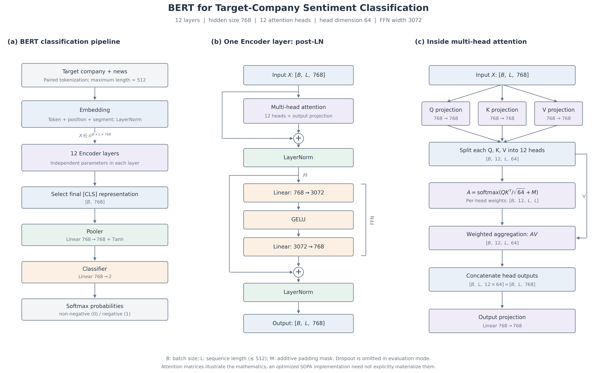
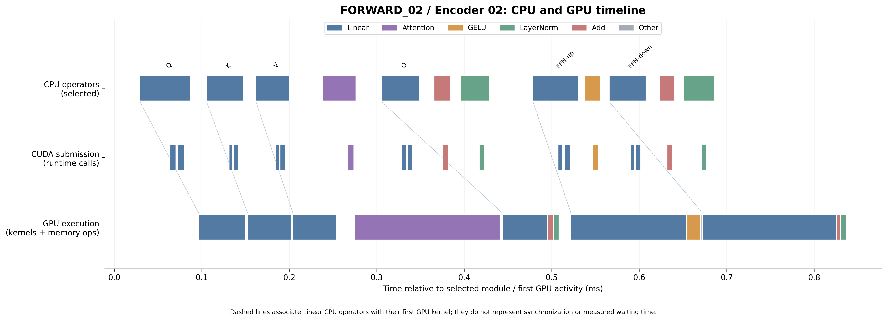

# Financial Text Classification & BERT Inference Optimization

An ML systems project combining **company-level Chinese financial news classification** with **model computation verification, GPU profiling, and inference optimization**.

The project fine-tunes BERT on article–company pairs, traces its execution from embeddings to classification logits, and evaluates mixed-precision inference on a single **NVIDIA RTX 3090 24GB**.

## Highlights

- **Classification:** improved validation Macro-F1 from **0.6211 to 0.7548** over a TF-IDF + Logistic Regression baseline.
- **Computation verification:** reconstructed a BERT Encoder layer and verified the complete forward path against native model outputs.
- **GPU profiling:** identified Linear operations as the largest contributor to recorded GPU operator time and examined CPU submission versus GPU execution.
- **Inference optimization:** reduced forward time from **8.312 to 6.544 ms** with FP16 automatic mixed precision — **1.270× faster, with 21.3% less time per forward**.
- **Quality validation:** preserved identical class predictions on all **1,942 validation samples**, with unchanged Accuracy and Macro-F1.

The timing comparison uses batch size 1 and a 512-token input. Full validation uses batch size 16.

## Task and Dataset

Given a **target company and a news article**, predict whether the article is negative for that company:

| Label | Meaning |
|---|---|
| `0` | Non-negative |
| `1` | Negative |

Data comes from [FinChina-SA](https://github.com/YerayL/FinChina-SA), associated with [Chinese Fine-Grained Financial Sentiment Analysis with Large Language Models](https://arxiv.org/abs/2306.14096). Original negative sentiment levels are mapped to `1`; other levels are mapped to `0`.

Each article can yield multiple company-specific samples. The implemented task assumes the target company is supplied; company extraction and event-subtype classification are outside its scope.

## Experimental Setup

| Component | Configuration |
|---|---|
| GPU | NVIDIA GeForce RTX 3090 24GB |
| Python | 3.12.3 |
| PyTorch | 2.5.1+cu124 |
| Transformers | 4.57.1 |
| Model | Fine-tuned `bert-base-chinese` |
| Architecture | 12 Encoder layers, hidden size 768, 12 attention heads |
| BERT input | Target company paired with article title and body |
| Maximum sequence length | 512 tokens |
| Precision comparison | FP32 vs FP16 automatic mixed precision |
| FP32 matmul TF32 | Disabled |

## Stage 1 — Data Preparation and Baselines

Converted **9,933 articles into 19,116 article–company samples** and split by normalized title/body groups before expanding company annotations. This keeps companies from the same article and exact normalized-content duplicates in the same partition, with **zero group overlap**.

| Split | Articles | Company samples | Negative | Non-negative |
|---|---:|---:|---:|---:|
| Training | 8,940 | 17,174 | 11,471 | 5,703 |
| Validation | 993 | 1,942 | 1,319 | 623 |

Established majority-class and character-level TF-IDF + Logistic Regression baselines. The latter achieved **0.7240 Accuracy and 0.6211 Macro-F1**, providing the reference for BERT evaluation.

[Details — notes in Chinese](docs/stage1_notes.md)

## Stage 2 — BERT Input and Training Pipeline

Implemented paired tokenization, batching, forward/loss computation, and a small training run with checkpoint save/reload validation. The input pipeline preserves the target-company segment and truncates the news segment when the combined input exceeds 512 tokens.

[Details — notes in Chinese](docs/stage2_notes.md)

## Stage 3 — Fine-Tuning and Classification Evaluation

Fine-tuned BERT for three epochs using AdamW, a learning rate of `2e-5`, and batch size 16.

| Model | Accuracy | Macro-F1 |
|---|---:|---:|
| Majority baseline | 0.6792 | 0.4045 |
| TF-IDF + Logistic Regression | 0.7240 | 0.6211 |
| Fine-tuned BERT | **0.7873** | **0.7548** |

BERT reduced false positives from **426 to 212**, while false negatives increased from **110 to 201**. The improvement in Macro-F1 reflects a more balanced result across the two classes.

The TF-IDF pipeline uses full text, whereas BERT uses truncated input; this comparison evaluates the implemented pipelines rather than architectures with identical visible text.

[Details — notes in Chinese](docs/stage3_notes.md)

## Stage 4 — BERT Computation Verification

Reconstructed **QKV projections, multi-head attention, output projection, residual connections, LayerNorm, and FFN**, then checked the complete path through 12 Encoder layers, CLS selection, Pooler, and Classifier.

**Key results:** the manually reconstructed first layer matched the native layer within a maximum absolute difference of approximately **1.91e-6** on the inspected input. Sequential execution through native modules reproduced the full model's logits exactly in the CPU check.

[Details — notes in Chinese](docs/stage4_notes.md)

## Stage 5 — GPU Profiling and Execution Analysis

Used PyTorch Profiler to connect model operations to GPU kernels and visualize CPU submission alongside GPU execution.

**Key finding:** Linear-related `aten::addmm` operations accounted for approximately **70.7% of recorded GPU operator self time** in the initial FP32 profile. These operations include QKV projections, attention output projections, and FFN layers.

The analysis distinguished **kernel execution time, elapsed execution intervals, and CPU-side operator duration**. Separate instrumentation experiments showed that hooks and profiling can affect measured performance, so optimization benchmarks were conducted without them.

[Details — notes in Chinese](docs/stage5_notes.md)

## Stage 6 — Mixed-Precision Inference Optimization

Applied FP16 automatic mixed precision while retaining FP32 model parameters, then evaluated speed, prediction agreement, and execution changes.

### Forward performance

| Mode | Forward time | Speedup |
|---|---:|---:|
| FP32 | 8.312 ms | 1.000× |
| AMP FP16 | **6.544 ms** | **1.270×** |

Timing uses the same GPU-resident input with **batch size 1 and sequence length 512**. Each condition has 20 warm-up calls and 50 measured calls per block, across four rounds with alternating execution order. Results are the median of block means, measured with CUDA Events.

Each forward enters a separate autocast context. Tokenization, input transfer, hooks, and Profiler are excluded from the benchmark.

### Validation quality

| Metric | FP32 | AMP FP16 |
|---|---:|---:|
| Accuracy | 0.787333 | 0.787333 |
| Macro-F1 | 0.754840 | 0.754840 |
| Changed predictions relative to FP32 | — | **0 / 1,942** |

Both modes use identical batches and input tensors at batch size 16. The maximum absolute probability difference was **0.001803**, and no NaN or Inf outputs were observed.

### Execution changes

| GPU kernel category | FP32 | AMP FP16 |
|---|---:|---:|
| Linear | 5.8693 ms | 1.9653 ms |
| Attention core | 1.9810 ms | 0.2922 ms |
| Copy / conversion | 0.0000 ms | 1.2029 ms |

Profiling showed lower Linear kernel time and an automatic attention-backend change from **memory-efficient attention to Flash Attention**, alongside additional copy/conversion work. The attention improvement therefore includes a backend change, not only reduced numerical precision.

These are profiled kernel-duration sums, separate from the unprofiled forward timings above.

[Details — notes in Chinese](docs/stage6_notes.md)

## Project Organization

| Directory | Purpose |
|---|---|
| `scripts/` | Training, evaluation, verification, profiling, and optimization |
| `practice/` | Data preparation and smaller implementation exercises |
| `results/` | Metrics, predictions, benchmark outputs, and generated traces |
| `figures/` | Classification, architecture, and performance visualizations |
| `docs/` | Supporting development and learning notes |
| `data/` | Local datasets; excluded from Git |
| `models/` | Local model artifacts; excluded from Git |

## What This Project Demonstrates

- Group-aware data preparation and comparison of classical and Transformer classifiers
- Numerical verification of Transformer internals and the complete inference path
- Operator-level profiling and interpretation of asynchronous CPU/GPU execution
- Controlled inference benchmarking with separate instrumentation checks
- Optimization evaluated against both runtime performance and classification quality

## Scope and Limitations

Reported classification results use one validation split; the reserved test set has not been evaluated. Exact-content grouping does not eliminate near-duplicates, and long articles may lose relevant evidence through BERT's 512-token truncation.

The measured speedup applies to the stated hardware and workload. It is a forward-time result, not end-to-end serving latency, and does not establish memory savings or equivalent gains at other batch sizes. Identical validation predictions do not guarantee agreement on all future inputs.

The project uses existing PyTorch and Transformers kernels. Custom kernel implementation and production serving are outside the completed scope.

