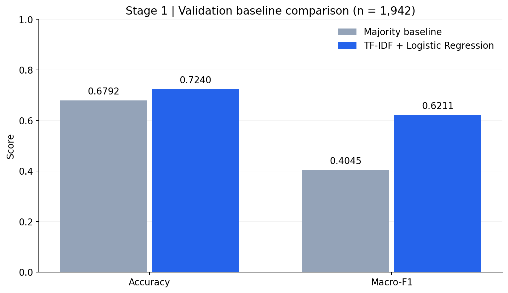
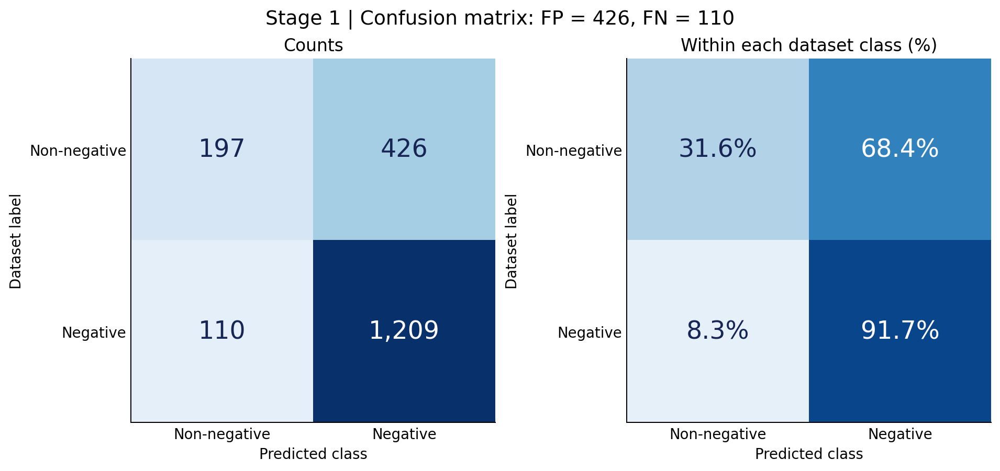
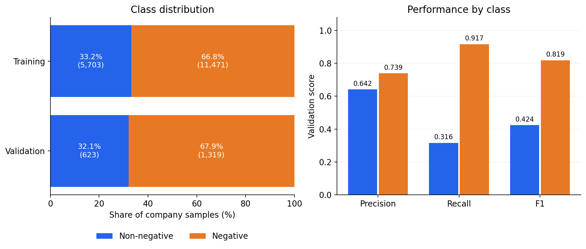

# Financial Text Analysis and Inference System

A learning-oriented ML project for **company-level Chinese financial news classification**, progressing toward model fine-tuning and GPU inference performance analysis.

**Current milestone: Stage 1 — Data Preparation and Baseline Evaluation.**

Given a **target company and a news article**, the current classifier predicts whether the article is negative for that company under a binary mapping of the dataset annotations. It does not automatically extract companies or classify event types. Non-negative does not mean positive investment news.

## Stage 1 results

- Prepared **19,116 article–company samples** from 9,933 articles in the original training file.
- Split articles by normalized-content groups before expanding company samples, with **zero group overlap** between training and validation.
- Trained a character-level **TF-IDF + Logistic Regression** baseline on 17,174 company samples.
- Achieved **0.6211 validation Macro-F1**, compared with 0.4045 for the majority baseline, on 1,942 validation samples.
- Analyzed false positives and false negatives, including two multi-company articles where all target companies received a negative prediction despite mixed dataset labels.

These are validation results from one split and one baseline run. BERT fine-tuning, final test evaluation, and inference performance experiments are not completed.

## Task and dataset

Data source: [FinChina-SA](https://github.com/YerayL/FinChina-SA), associated with [Chinese Fine-Grained Financial Sentiment Analysis with Large Language Models](https://arxiv.org/abs/2306.14096).

One source article can contain multiple company annotations. Each article–company pair becomes a separate classification sample:

```json
{
  "article_id": 123,
  "title": "Example news title",
  "text": "Example article text",
  "company": "Example target company",
  "raw_label": "-1",
  "label": 1
}
```

The example above is schematic, not a real dataset record.

| Original annotation | Binary label | Meaning |
|---|---:|---|
| -1, -2, -3 | 1 | Negative |
| 0, 1, 2 | 0 | Non-negative |

The implemented conversion uses `int(sentiment_level) < 0` on the inspected label set. Unexpected values should be checked before using other data. This binary task differs from the paper's original fine-grained evaluation.

### Fixed split

| Split | Articles | Company samples | Negative | Non-negative |
|---|---:|---:|---:|---:|
| Training | 8,940 | 17,174 | 11,471 | 5,703 |
| Validation | 993 | 1,942 | 1,319 | 623 |

The original training file contained no duplicate article IDs and seven extra articles with identical whitespace-normalized title/body content. Matching content was kept in the same group. Duplicate records were **retained within groups**, not fully deduplicated. The group split used seed 42 and approximately 90%/10% of groups. All company annotations for an article remain together.

The author-provided test file is reserved for final evaluation and has not been used to choose this baseline. Exact content grouping does not rule out near-duplicate articles or establish a chronological split.

## Baseline method

The model receives the target company followed by the full title and body:

```python
text = (
    f"目标公司：{sample['company']}\n"
    f"标题：{sample['title']}\n"
    f"正文：{sample['text']}"
)
```

| Component | Configuration |
|---|---|
| Feature extraction | `TfidfVectorizer(analyzer="char", ngram_range=(2, 4), min_df=3, max_features=50000)` |
| Classifier | `LogisticRegression(max_iter=1000, random_state=42)` |
| Majority baseline | Predict class 1, selected from the training labels |
| Fitting | Training split only; validation uses the fitted pipeline |
| Input scope | Full text; no BERT tokenizer or Transformer is used |

### Validation performance

| Model | Accuracy | Macro-F1 |
|---|---:|---:|
| Majority baseline | 0.6792 | 0.4045 |
| TF-IDF + Logistic Regression | **0.7240** | **0.6211** |



| Class | Precision | Recall | F1 | Support |
|---|---:|---:|---:|---:|
| Non-negative | 0.6417 | 0.3162 | 0.4237 | 623 |
| Negative | 0.7394 | 0.9166 | 0.8186 | 1,319 |



Rows are dataset labels; columns are predictions, ordered `[non_negative, negative]`. There are **426 false positives** and **110 false negatives**. The model predicts negative for 1,635 of 1,942 samples (84.2%).



The baseline improves over always predicting the majority class, but non-negative recall remains low. Accuracy alone hides this weakness.

## Error analysis

| Article ID | Target / situation | Observation |
|---|---|---|
| 672492854 | Huaqi, mentioned as an invested company | False positive; the reported event concerns another company's controller. |
| 670901039 | Asia-Pacific accounting firm | False positive; the auditor reports problems at its client, rather than being described as penalized itself. |
| 670790738 | Zhongtian Fluorosilicone | False negative despite an explicit IPO termination event. Feature-level causes have not been established. |
| 672739753 | Xingyin Growth Capital | False negative relative to an original “related enterprise issues” annotation; the intended scope of company-level negativity needs clarification. |

In the first two articles, all six company samples were predicted negative: two matched negative labels and four were false positives. These were deliberately inspected error cases, not a representative sample. Identical predicted labels do not imply identical prediction scores or prove that company names have no effect.

## Repository organization

| Path | Purpose |
|---|---|
| `practice/` | Data-conversion, splitting, and small PyTorch learning exercises |
| `scripts/stage1_train_baseline.py` | Existing baseline training and evaluation script |
| `scripts/stage1_inspect_errors.py` | Existing validation error inspection script |
| `scripts/stage1_plot_results.py` | Reproduce the Stage 1 figures |
| `docs/stage1_notes.md` | Chinese learning notes, findings, and limitations |
| `docs/github_upload.md` | Packaging and first-push instructions |
| `results/stage1_baseline/` | Aggregate results and original local evaluation outputs |
| `results/stage1_learning/` | Reported numbers from the synthetic Linear exercise |
| `figures/stage1_baseline/` | Financial-classification result figures |
| `figures/stage1_learning/` | Educational plots, separate from project evaluation |
| `data/raw/`, `data/processed/` | Local datasets; excluded from Git |
| `models/` | Local model artifacts; excluded from Git |

The documentation package supplements the existing server project. It does not contain or replace the original training/preparation scripts.

## Run the current milestone

The existing server environment uses Python 3.12.3 and scikit-learn 1.6.1. PyTorch 2.5.1+cu124 is used for the learning exercise, not for training the TF-IDF classifier. The RTX 3090 is available for later neural-model work; Stage 1 does not establish GPU speed measurements.

1. Use a Python environment with the dependencies listed in `requirements-stage1.txt`. Retain a known working environment rather than upgrading it just to make plots. Capture actual package versions as described in the upload guide.
2. Obtain the dataset from the original repository and place its files at `data/raw/train.json` and `data/raw/test.json`.
3. In the existing project, regenerate the fixed split if needed:

```bash
python practice/split_data.py
```

4. Train and inspect the baseline:

```bash
python scripts/stage1_train_baseline.py
python scripts/stage1_inspect_errors.py
```

5. Reproduce figures from the recorded aggregate snapshot, without retraining:

```bash
python scripts/stage1_plot_results.py
```

To recompute the baseline plots from the original local prediction file:

```bash
python scripts/stage1_plot_results.py --predictions results/stage1_baseline/validation_predictions.jsonl
```

The snapshot `reported_summary.json` was transcribed from the original server output; it is not a replacement for the original `validation_metrics.json` or prediction file. The Linear figure similarly uses recorded, rounded outputs rather than a new training run. Exact environment capture and clean-environment reproduction remain follow-up work. The original run reported an `iprint` solver-option warning; package compatibility should be checked before pinning a fully reproduced environment.

## Roadmap

- [x] **Stage 1 — Data and baseline:** sample conversion, grouped split, majority/TF-IDF baselines, initial error analysis, and result figures.
- [ ] **Stage 2 — BERT input and training basics:** tokenizer, paired input, tensor shapes, forward pass, tiny-sample training, save/reload.
- [ ] **Stage 3 — Fine-tuning and evaluation:** full training, validation comparison, broader error analysis, and one controlled improvement.
- [ ] **Stage 4 — Inference and performance:** prediction entry point, input-length/batch experiments, GPU timing, throughput, memory, and quality trade-offs.
- [ ] **Stage 5 — Final evaluation and release:** freeze choices, evaluate the reserved test set, verify reproduction, and summarize completed results.

## Limitations and next questions

- The baseline has limited demonstrated ability to associate events with the specified target company.
- Some labels involve related-company risk or uncertain entity mappings; annotation disagreement is not automatically a model-understanding failure.
- Only initial cases have been reviewed; the planned broader review of at least 20 validation errors is not complete.
- Future BERT inputs may be truncated. A fair model comparison must distinguish same-visible-text results from this full-text baseline.
- No BERT fine-tuning, GPU inference acceleration, real-time news ingestion, or trading-return evaluation has been completed.
- Raw news, processed full text, and full-text prediction files are not redistributed here. Obtain data from the original source and follow its applicable terms.

See [Stage 1 notes](docs/stage1_notes.md) for the learning record, including the distinction between the synthetic Linear exercise and financial classification.
