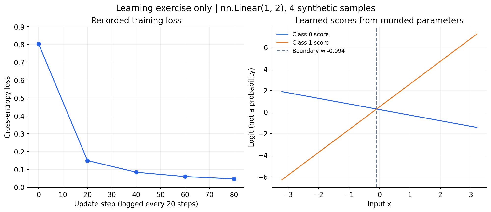

# Stage 1 — 数据准备、训练入门与 Baseline

项目：Financial Text Analysis and Inference System  
记录日期：2026 年 9 月 28—29 日

## 1. 项目任务

当前输入：**目标公司 + 新闻标题 + 正文**。

Training（训练）时，新闻和目标公司由数据集提供；使用模型时，可以由使用者输入。

当前输出：该新闻对目标公司的描述属于 **negative（负面）** 还是 **non-negative（非负面）**。

当前不自动抽取公司，也不预测 `label_type` 事件类型。原始数据有这些字段，不代表模型已经学会输出它们。

Non-negative 不等于利好，也可能只是中性或背景信息。分类结果不等同于股票涨跌预测。

### 为什么一篇新闻不能只给一个统一 Label

Label（标签）必须对应具体公司。

一篇新闻可能同时提到经营出问题的公司、正常履职的审计机构、投资方和其他背景公司，对不同公司的描述不一定属于同一类别。

例如，喜相逢受到问询关注，对喜相逢属于负面信息；文中提到滴滴曾投资喜相逢，这一描述本身属于背景信息，不能直接认定对滴滴也是负面。

因此，一条训练 sample（样本）需要包含：

**新闻 + 目标公司 + 对应标签。**

### Sentiment Label 与 Event Type 的区别

- Sentiment label（情绪标签）：表示针对公司的情绪类别或负面程度，例如原始标签 `-1`。
- Event type（事件类型）：描述具体发生了什么，例如“受到问询关注”或“行政处罚”。

当前模型只学习二分类标签，不学习输出具体事件类型。

## 2. 最初阅读的样本与数据疑问

### 样本一：荣盛商行销售过期食品

目标公司：深圳市南山区蛇口市场荣盛商行。

我的判断：negative。因为新闻描述它销售过期食品，并受到处罚。

数据标注：原始情绪标签为 `-1`，与我的判断一致。

### 样本二：喜相逢七次冲击港股 IPO

新闻标题：喜相逢七次冲击港股IPO 业务经营合规性等受关注。

| 标注公司 | 原始情绪标签 | 二分类 | 事件类型 |
|---|---:|---|---|
| 北京小桔科技有限公司 | 0 | Non-negative | 非负面指标(小类) |
| 喜相逢融资租赁集团有限公司 | -1 | Negative | 受到问询关注 |
| 滴滴全球有限公司 | 0 | Non-negative | 非负面指标(小类) |

我最初认为喜相逢和滴滴都属于 negative。讨论后理解到：需要分别查看新闻对每家公司的具体描述，不能因为公司出现在同一篇负面新闻里，就给它们相同的标签。

此外，“被要求说明合规情况”不等于“已经被认定违规”，判断时要保留原文的程度。

### 公司名称与原文的对应疑问

在喜相逢这篇新闻的正文中，我没有发现“北京小桔科技有限公司”的直接提及。

正文提到了“滴滴”“北京车胜”和“HitDrive”，但仅凭这段文字，不能确认它们与该标注公司的具体对应关系。

可能涉及公司名称或关联关系映射，也可能是 annotation（标注）问题，目前待核查。不能仅根据数据集给出的标签，就认为该对应关系已经得到确认。

处理数据时，需要保留这类疑问，而不是直接认定标签正确或错误。

## 3. 原始数据如何变成 Sample

数据来源：[FinChina-SA 作者仓库](https://github.com/YerayL/FinChina-SA)。

原始 `train.json` 和 `test.json` 是作者提供的划分。我们从原始 train 再划出 validation（验证集），用于选择模型；原始 test（测试集）留给最终评估。

### 原始记录结构

`institution` 是 list（列表），每个元素是对应公司的 dict（字典）：

```python
{
    "ins_name": "深圳市南山区蛇口市场荣盛商行",
    "sentiment_level": "-1",
    "label_type": "行政处罚",
    "PriOrSec": 1,
}
```

`sentiment_level` 原本是 str（字符串）。项目保留原始值，并增加模型使用的整数 label：

| 原始值 | 新 label | 含义 |
|---|---:|---|
| -1 / -2 / -3 | 1 | Negative |
| 0 / 1 / 2 | 0 | Non-negative |

这是本项目选定的统一约定，不是所有模型都必须采用的标签形式。

### 为什么下载后还要处理数据

下载的数据虽然已经分为 train/test，但源文件以文章组织，而当前训练单位是“文章—公司”组合。

因此还需要：

- 将一篇文章中的多家公司展开为多条 sample。
- 统一二分类标签，并保留原始标签。
- 从原始 train 中划出独立 validation。
- 保存便于训练和检查的数据格式。

### Sample 转换核心

```python
def convert_articles(articles):
    samples = []

    for article in articles:
        for company in article["institution"]:
            raw_label = int(company["sentiment_level"])

            sample = {
                "article_id": article["newscode"],
                "title": article["title"],
                "text": article["text"],
                "company": company["ins_name"],
                "raw_label": company["sentiment_level"],
                "label": 1 if raw_label < 0 else 0,
            }

            samples.append(sample)

    return samples
```

外层遍历文章，内层遍历文章中的公司，每家公司生成一个 sample。

`raw_label < 0` 的判断适用于已检查的标签集合；以后换数据，未知值应先核查。

`PriOrSec` 的确切官方定义尚未确认，当前不作为模型输入。也不能把原始 `label_type` 拼到输入里，否则可能向模型透露答案。

### JSON 与 JSONL

- JSON 通常用一个整体对象或数组保存数据。
- JSONL 每行保存一个完整 JSON 对象，便于逐条读取、写入预测和追踪错误。

转换格式不会自动提高数据质量，仍然需要检查字段、标签及划分。

## 4. 数据检查与划分

### 原始 Training 文件统计

| 项目 | 数量 |
|---|---:|
| Articles（文章） | 9,933 |
| 文章—公司 samples | 19,116 |
| Negative samples | 12,790 |
| Non-negative samples | 6,326 |
| Negative ratio（占比） | 66.9% |

一篇文章可能涉及多家公司，因此展开后的 sample 数量多于文章数量。

在完整原始 training 文件上，全部预测为 negative 就能达到约 66.9% 的 Accuracy（准确率）。这说明评估模型时必须与简单 baseline 比较，不能只看 Accuracy。

### 重复检查

- 重复 ID 的额外条数：0。
- 标题与正文去除空白后，重复内容的额外条数：7。
- 相同标准化内容归为同一个 group（组）。
- 重复记录仍保留在同一组内，目前没有完成去重合并。

### 划分方法

以 seed（随机种子）42 做约 9:1 的 group 划分。

**先划分文章组，再展开每家公司对应的 sample。**

这样，同一篇文章中的公司，以及具有相同标准化内容的文章，会留在同一个集合中。

| 集合 | Articles | Samples | Negative | Non-negative | Negative ratio |
|---|---:|---:|---:|---:|---:|
| Training | 8,940 | 17,174 | 11,471 | 5,703 | 66.8% |
| Validation | 993 | 1,942 | 1,319 | 623 | 67.9% |

两个集合的 group 交集为 0。

这能避免同篇或相同内容的新闻被拆到两边，产生 data leakage（数据泄漏，例如验证集出现训练中已见过的重复内容）。这项检查不保证排除近似转载等全部泄漏。

9:1 是本项目数据量下的选择，不是 LLM 或文本分类必须遵守的比例。Validation 用于选择方案，test 用于最终评估。

## 5. Linear 小练习

### 输入与输出

训练输入：

```python
X = [[-2], [-1], [1], [2]]
y = [0, 0, 1, 1]
```

模型：

```python
model = nn.Linear(1, 2)
```

`1` 表示每条 sample 有一个输入 feature（特征），`2` 表示输出两个类别的 score（分数）。

| Tensor（数值数组） | Shape（形状） | 含义 |
|---|---|---|
| X | `[4, 1]` | 4 条 sample，每条 1 个特征 |
| logits | `[4, 2]` | 每条 sample 的两个未归一化类别分数 |
| y | `[4]` | 每条 sample 的正确类别编号 |

### Training 核心流程

```python
optimizer.zero_grad()       # 清除上一次累积的 gradient（梯度）
logits = model(X)           # forward（前向计算）：得到类别分数
loss = criterion(logits, y) # loss（损失）：衡量预测与标签的差距
loss.backward()            # backward（反向传播）：计算并保存梯度
optimizer.step()           # optimizer（优化器）根据梯度更新参数
```

`loss.backward()` 返回 `None`；梯度保存在参数的 `.grad` 中，不需要写：

```python
gradient = loss.backward()
```

`weight`（权重）和 `bias`（偏置）都是可学习参数。

练习使用 CrossEntropyLoss（交叉熵损失）和 SGD（随机梯度下降优化器），learning rate（学习率）为 0.1，更新 100 次。

### 实际结果

| Step | 终端记录的 loss |
|---:|---:|
| 0 | 0.8027 |
| 20 | 0.1493 |
| 40 | 0.0837 |
| 60 | 0.0594 |
| 80 | 0.0464 |

更新前：

```text
weight = [0.7645, 0.8300]
```

更新后：

```text
weight = [-0.5189, 2.1135]
bias   = [0.2182, 0.4662]
```

训练输入的预测为 `[0, 0, 1, 1]`，与标签一致。

新输入 `[-3, -0.2, 0.2, 3]` 的预测也为 `[0, 0, 1, 1]`。

### 模型实际学到了什么

根据终端显示的参数，两类分数近似为：

```python
score_0 = -0.5189 * x + 0.2182
score_1 =  2.1135 * x + 0.4662
```

预测时选择分数较大的类别。

两条直线相交在约 `x = -0.094`，不是严格等于 0。因此，四条新输入预测正确，并不证明模型学会了适用于全部实数的“正负号规则”。



图左只连接实际记录的五个 loss 点；图右使用终端四舍五入后的参数计算。

这个练习用于理解参数更新，不属于金融文本模型的准确率或加速成果。

## 6. TF-IDF Baseline

Baseline（基线）是后续模型需要比较的起点。当前建立了两种：

1. Majority baseline（多数类基线）：根据 training 中的类别数量，始终输出 negative。
2. TF-IDF + Logistic Regression（逻辑回归）：将文本转换为特征，再学习二分类。

### TF-IDF 如何处理中文

TF-IDF 表示 term frequency–inverse document frequency（词频与逆文档频率的组合）。

本项目使用字符级 n-gram（连续字符片段），取长度 2—4 的片段。例如，“行政处罚”包含“行政”“处罚”“行政处罚”等候选特征。

这些片段被转换为数值特征，再输入分类器。这里没有使用 BERT tokenizer（将文本转换成 BERT 所需 token 编号的工具）或 Transformer 模型。

### 输入格式

```python
text = (
    f"目标公司：{sample['company']}\n"
    f"标题：{sample['title']}\n"
    f"正文：{sample['text']}"
)
```

当前输入包括目标公司、标题和全文。

把公司名称写进输入，不等于模型已经理解了“只判断这家公司”这条要求。

### 配置

```python
TfidfVectorizer(
    analyzer="char",
    ngram_range=(2, 4),
    min_df=3,
    max_features=50000,
)

LogisticRegression(
    max_iter=1000,
    random_state=42,
)
```

词表、IDF 与分类器参数只在 training 上 fit（拟合）；validation 使用已拟合的同一个 pipeline（把特征转换与模型串起来的流程）。

实际迭代次数为 53，小于上限 1000。

终端出现：

```text
Unknown solver options: iprint
```

记录为依赖兼容性待核查事项。它不是“已达到迭代上限”的提示，也不能仅凭迭代次数就断言所有优化检查都通过。

## 7. Validation 结果与指标

### 整体结果

| Model | Accuracy | Macro-F1 |
|---|---:|---:|
| Majority baseline | 0.6792 | 0.4045 |
| TF-IDF + Logistic Regression | 0.7240 | 0.6211 |

Accuracy 提高约 4.48 个百分点；Macro-F1 提高 0.2166。

Macro-F1 是各类别 F1 的算术平均，不是“62.11% 的 sample 预测正确”。


### 各类别指标

- Precision（精确率）：预测为该类的 sample 中，有多少确实属于该类。
- Recall（召回率）：实际属于该类的 sample 中，有多少被找回。
- F1：Precision 与 Recall 的调和平均。
- Support：数据集中该类的实际 sample 数量。

| 类别 | Precision | Recall | F1 | Support |
|---|---:|---:|---:|---:|
| Non-negative | 0.6417 | 0.3162 | 0.4237 | 623 |
| Negative | 0.7394 | 0.9166 | 0.8186 | 1,319 |

### Confusion Matrix

Confusion matrix（混淆矩阵）的行是数据集标签，列是预测：

| | 预测 non-negative | 预测 negative |
|---|---:|---:|
| 数据集 non-negative | 197 | 426 |
| 数据集 negative | 110 | 1,209 |

以 negative 为 positive class（关注的正类）：

- False positive（误报）：426。
- False negative（漏报）：110。

“正类”是数学约定，不代表情绪正面。

模型将 1,635 / 1,942，即约 84.2% 的 validation samples 预测为 negative，而数据集 negative 占 67.9%。

它能找回多数负面，但很容易把非负面公司也判为负面。


## 8. Error Analysis

Error analysis（错误分析）需要区分：原文支持的判断、数据集的标注口径，以及尚未验证的模型错误原因。

### 四条误判案例

| Article ID | 目标公司 | 数据集 label → prediction | 观察 |
|---|---|---|---|
| 672492854 | 华奇(中国)化工有限公司 | 0 → 1 | 只是被列为投资企业，正文未描述它自身负面事件 |
| 670901039 | 亚太(集团)会计师事务所(特殊普通合伙) | 0 → 1 | 审计机构报告客户问题，不等于审计机构自身被处罚 |
| 670790738 | 浙江中天东方氟硅材料股份有限公司 | 1 → 0 | 明确的“IPO 被终止”事件漏报 |
| 672739753 | 兴银成长资本管理有限公司 | 1 → 0 | 原始事件是“相关企业问题”，需核查标注口径 |

前两条支持模型在这些案例中没有充分区分事件主体与背景公司。

第三条中，“背景特征掩盖了关键事件”只是待验证假设。输入包含标题，不能说模型没有接收到标题信息。

第四条中，减持与被投资公司的股价变化，不一定直接代表投资公司自身经营出问题。模型与数据集 label 不一致，不能仅凭这一点证明模型语义理解错误。

### 同篇新闻、不同目标公司的检查

Article ID：672492854。

| 目标公司 | 数据集 label | Prediction |
|---|---:|---:|
| 上海彤程电子材料有限公司 | 0 | 1 |
| 中策橡胶集团股份有限公司 | 0 | 1 |
| 华奇(中国)化工有限公司 | 0 | 1 |
| 彤程新材料集团股份有限公司 | 1 | 1 |

Article ID：670901039。

| 目标公司 | 数据集 label | Prediction |
|---|---:|---:|
| 亚太(集团)会计师事务所(特殊普通合伙) | 0 | 1 |
| 河南新野纺织股份有限公司 | 1 | 1 |

这两篇新闻中，六个公司 sample 全部预测为 negative，其中两条正确、四条误报。

结果支持当前 baseline 在这些例子中 target sensitivity（目标公司变化时，输出是否相应变化）不足。

但需要注意：

- 不能据此认定所有新闻都存在相同问题。
- 相同 prediction 不代表内部输出分数完全相同。
- 不能用这六条经过选择的 sample 推算总体错误率。

### 对 Annotation 疑问的处理

公司全名未出现在正文，可能涉及简称、主体映射或标注问题；缺少说明时先记录疑问。

不根据模型输出去修改 validation 的 reference label（用于评估的参考标签）。如果修订标注，需要统一规则，并保留原标签与修订版本。

## 9. 文件与结果记录

正式脚本统一使用 `scripts/stageN_功能.py`；练习继续保留在 `practice/`。

| 文件 | 用途 |
|---|---|
| `models/stage1_baseline/tfidf_logistic_fulltext.joblib` | 已训练的 TF-IDF 与分类器 pipeline |
| `results/stage1_baseline/validation_metrics.json` | 原始 validation 指标 |
| `results/stage1_baseline/validation_predictions.jsonl` | 原始逐条预测，留在本地 |
| `results/stage1_baseline/reported_summary.json` | 根据实际终端输出整理的绘图摘要 |
| `results/stage1_learning/linear_reported_summary.json` | Linear 练习的实际输出摘要 |
| `scripts/stage1_plot_results.py` | 绘图脚本，不重新训练模型 |
| `docs/stage1_notes.md` | 本阶段学习与实验记录 |

绘图摘要用于复现图表，不替代原始指标与逐条预测文件。

生成图表：

```bash
python scripts/stage1_plot_results.py
```

根据原始 prediction 文件重新计算金融分类图表：

```bash
python scripts/stage1_plot_results.py \
    --predictions results/stage1_baseline/validation_predictions.jsonl
```