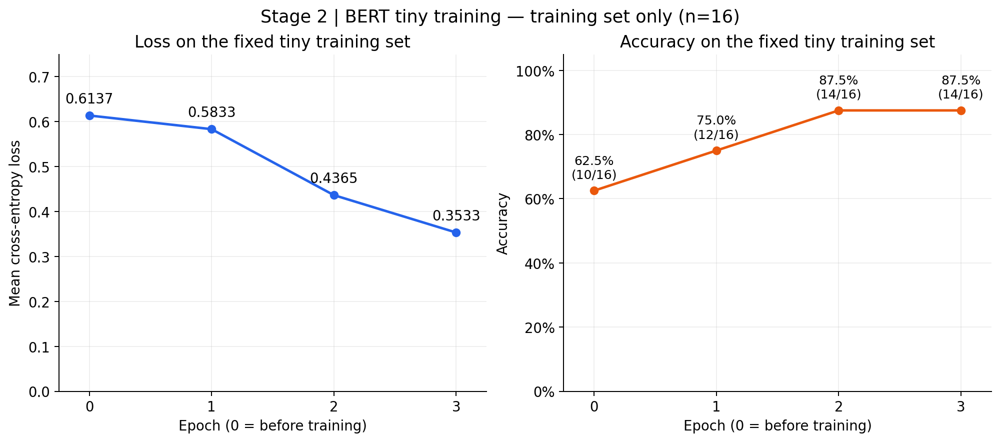

# Stage 2 — BERT 输入、Tiny Training 与模型保存

项目：Financial Text Analysis and Inference System  
记录日期：2026 年 9 月 30 日—10 月 1 日

## 1. 本阶段的目的

在正式训练前，跑通并理解完整流程：

文本 → tokenizer → BERT → logits → loss → 参数更新 → 保存 → 重新加载。

本阶段使用少量 training samples 检查模型能否学习，没有进行独立 validation 或推理性能测试。

## 2. 环境与模型

| 项目 | 配置 |
|---|---|
| Python | 3.12.3 |
| PyTorch | 2.5.1+cu124 |
| Transformers | 4.57.1 |
| Tokenizers | 0.22.2 |
| Hugging Face Hub | 0.36.2 |
| Safetensors | 0.8.0 |
| GPU | NVIDIA RTX 3090 24GB |
| 模型 | google-bert/bert-base-chinese |

服务器无法直接连接 Hugging Face，出现：

```text
Network is unreachable
```

通过 HF-Mirror 第三方镜像完成下载：

```bash
HF_ENDPOINT=https://hf-mirror.com python scripts/stage2_inspect_tokenizer.py
```

这个写法仅为本次命令指定下载地址。缓存保存在项目的 `.cache/huggingface/`，该目录已被 Git 忽略。

## 3. Tokenizer 如何处理一条 Sample

Tokenizer（将文本转换为 token 和编号的工具）接收两段文本：

- 第一段：目标公司。
- 第二段：新闻标题 + 正文。

公司与新闻承担不同角色，但合起来仍然是一条 sample（样本）。

BERT 的输入组织为：

```text
[CLS] 目标公司 [SEP] 新闻标题和正文 [SEP]
```

其中：

- `[CLS]`：开头的特殊 token，分类模型使用该位置的表示进行后续分类计算。
- `[SEP]`：用于分隔文本段和标记结束。
- Token：模型处理文本的基本单位，可能是汉字、标点、英文词片段或特殊符号。

### 三个输入字段

| 字段 | 含义 |
|---|---|
| `input_ids` | 每个 token 在词表中的编号 |
| `token_type_ids` | 区分公司段与新闻段，分别为 0 和 1 |
| `attention_mask` | 标记真实输入位置与 padding 位置，分别为 1 和 0 |

Token ID 只是编号，不是情绪分数；`token_type_ids` 中的 0/1 也不是分类 label（标签）。

### 实际样本

目标公司：深圳市南山区蛇口市场荣盛商行。

| 部分 | Token 数 |
|---|---:|
| 公司名 | 14 |
| 新闻标题 + 正文 | 430 |
| 特殊 tokens | 3 |
| 合计 | 447 |

例如：

```text
深 → 3918
圳 → 1766
市 → 2356
```

公司名和标题都包含“深圳市”，所以对应 token ID 会重复出现，属于正常现象。

## 4. Truncation 与 Padding

### Truncation：输入太长时截短

使用：

```python
truncation="only_second"
```

表示只截断第二段新闻，保留公司段。

| `max_length` | 处理后长度 | 截去的 tokens |
|---:|---:|---:|
| 128 | 128 | 319 |
| 512 | 447 | 0 |

当上限为 128 时，新闻可使用的长度为：

```text
128 - 14 个公司 tokens - 3 个特殊 tokens = 111
```

因此截去：

```text
430 - 111 = 319 tokens
```

`max_length` 是整个输入的长度上限，不是正文单独的长度预算。

设置上限 512 且 `padding=False` 时，实际只有 447 tokens，因此不会自动补到 512。

### Padding：让不同 Sample 的完整序列长度一致

Padding（补齐）不是让公司名与正文等长。

一条 sample 内部，两段直接连接：

```text
[CLS] 公司名 [SEP] 标题和正文 [SEP]
```

需要补齐的是同一个 batch 内不同 sample 的完整序列。

| 设置 | 行为 |
|---|---|
| `padding=False` | 不补齐 |
| `padding=True` 或 `"longest"` | 补到本次输入批次中的最长长度 |
| `padding="max_length"` | 补到指定长度；仍需单独设置 truncation 处理超长输入 |

### 实际 Padding 实验

为了观察长度差异，用同一篇新闻构造了两条演示输入：

1. 公司 + 标题。
2. 公司 + 标题 + 正文。

它们是两条 sample，不是同一条 sample 内需要对齐的两个部分。

| 输入 | 真实 tokens（含特殊 tokens） | Padding | 总长度 |
|---|---:|---:|---:|
| 公司 + 标题 | 51 | 396 | 447 |
| 公司 + 标题 + 正文 | 447 | 0 | 447 |

最终：

```text
input_ids shape：(2, 447)
token_type_ids shape：(2, 447)
attention_mask shape：(2, 447)
```

第一条末尾出现 `[PAD]`，对应 mask 为 0。第二条不需要 padding，mask 全为 1。

### 与性能的关系

这一批共有：

```text
2 × 447 = 894 个位置
```

其中 padding 占：

```text
396 / 894 ≈ 44.3%
```

这不是运行时间的测量结果。

`attention_mask=0` 不意味着对应位置的所有计算都会自动跳过。常规批量计算仍可能在这些位置消耗计算与显存，因此输入长度搭配会影响效率。

## 5. Tensor Shape 与 Batch Size

Tensor（张量）可以理解为按多个轴组织的数值数组。轴不一定对应物理空间维度。

```python
[12323, 24232]
# 一维 tensor，shape：(2,)
```

```python
[
    [12323, 24232]
]
# 二维 tensor，shape：(1, 2)
```

对于 `input_ids`：

```text
shape = (batch_size, sequence_length)
```

- Batch：一起处理的一组 sample。
- Batch size：这一组有多少条 sample。
- Sequence length：每条 sample 补齐后的 token 位置数。

例如四条 sample 的完整长度为：

```text
80、120、200、150
```

按当前 batch 最长长度补齐后，shape 为：

```text
(4, 200)
```

Padding 改变位置数量，不改变 sample 数量。

## 6. BERT 与 768 维表示

Tokenizer 负责将文字转换成编号；BERT 根据这些编号计算包含上下文信息的表示。

### 768 是什么

Hidden size（隐藏表示宽度）为 768，表示每个 token 位置用 768 个数表示。

这不意味着 BERT 只有 768 个参数。

```text
Token ID：3918
    ↓ embedding
一个包含 768 个数的向量
```

Embedding（嵌入）把 token ID 映射为可学习的数值向量。BERT 还结合位置与文本段信息，随后通过多层计算处理上下文。

例如“银行”和“行走”中的“行”可以使用相同 token ID，但经过上下文处理后的表示可以不同。

### 两种“维度”的区别

- 三维 tensor：指有三个轴，例如 `(2, 447, 768)`。
- 768 维向量：指一个向量有 768 个分量，单独取出来的 tensor shape 为 `(768,)`。

### 分类过程的 Shape

```text
Token IDs                  (2, 447)
BERT 各位置的表示           (2, 447, 768)
用于分类的表示              (2, 768)
分类层输出 logits           (2, 2)
```

分类模型使用 `[CLS]` 位置的表示，经模型的 pooling 等处理后送入分类层。

分类层可理解为：

```python
nn.Linear(768, 2)
```

接收 768 个数，输出两个类别分数。

### 预训练参数在做什么

BERT 预训练学习了部分语言与上下文规律。一个主要预训练任务是 masked language modeling（遮盖部分 token，再根据上下文预测）。

这些规律保存在 embedding、attention 及其他层的参数中，不是一份可以直接查阅的新闻答案库。

本项目新加的分类层还需要通过公司级标签学习任务，所以预训练 BERT 并不等于已经训练好的金融二分类模型。

## 7. Logits、预测与 Loss

### Logits 是原始分数

Logits 是模型给各类别的原始分数，可以为负，也可以大于 1，不要求总和为 1。

最初 forward 的结果：

```text
[
    [0.3333, 0.3171],
    [0.3839, 0.3498]
]
```

每行对应一条完整输入，每列对应一个类别：

```text
第 0 列：non-negative
第 1 列：negative
```

两行都是第 0 列更大，因此预测为 `[0, 0]`。

```python
predictions = logits.argmax(dim=1)
```

`dim=1` 表示沿每行的类别方向，寻找最大分数的列编号。

### Logits 与概率

Softmax（将分数转换为总和为 1 的概率分布）关注类别分数之间的相对差距。

例如：

```text
logits：[0.732, 0.414]
softmax 后约为：[0.579, 0.421]
```

Logits 不是概率；转换后的概率也不保证经过 calibration（校准，即预测概率与实际发生频率相匹配）。

### CrossEntropyLoss

CrossEntropyLoss（交叉熵损失）衡量模型输出与正确标签的不一致程度。

对于当前使用的单个整数类别标签：

```text
loss = -ln(模型给正确类别分配的概率)
```

例如正确类别为 1，概率为 0.421：

```text
loss ≈ -ln(0.421) ≈ 0.865
```

它不是将 logits 与 `[0, 1]` 直接相减。实际代码直接传入 logits 和整数标签：

```python
loss = criterion(logits, labels)
```

不需要先手动 softmax。

首次演示中：

```text
Logits shape：(2, 2)
Labels：[1, 1]
Labels shape：(2,)
平均 loss：0.7058
```

Loss 不是错误率。预测类别没变，正确类别的概率提高，也可能让 loss 下降。

## 8. 参数如何更新

### 核心流程

```python
optimizer.zero_grad()
outputs = model(..., labels=batch_labels)
loss = outputs.loss
loss.backward()
optimizer.step()
```

- `zero_grad()`：清除之前的梯度。
- Forward：根据当前参数计算预测与 loss。
- `backward()`：计算梯度，保存在参数的 `.grad` 中。
- `step()`：由 optimizer（优化器）更新参数。

Loss 不是被 optimizer 直接修改的参数。参数更新后，下一次 forward 会重新计算 loss。

每次 batch 可能不同，训练模式还有随机因素，因此 loss 不保证每一步下降。

### BERT 与分类层一起更新

本次使用：

```python
optimizer = torch.optim.AdamW(
    model.parameters(),
    lr=2e-5,
    weight_decay=0.01,
)
```

没有冻结参数，`model.parameters()` 包含 BERT 本体和分类层的参数，两部分都参与更新。

分类层学习如何根据表示打分；BERT 学习如何产生更适合该任务的表示。

### 参数与中间表示的区别

| 对象 | 性质 | 变化方式 |
|---|---|---|
| Embedding 表 | 可训练参数 | Optimizer 更新表中的数值 |
| Attention 等层的 weight | 可训练参数 | Optimizer 根据梯度更新 |
| 某层计算出的 768 个数 | 中间结果 | 参数或输入变化后，通过 forward 重新计算 |

不是直接把所有中间表示当成参数修改。

以简单 SGD 为例：

```text
新参数 = 旧参数 - learning_rate × gradient
```

每个参数分量有自己的梯度，不是给整组 768 个数统一加减一个值。

实际使用的 AdamW 会利用历史梯度信息调整更新量，并应用 weight decay（权重衰减），更新方式比这个示例复杂。

## 9. Tiny Training 实验

Tiny training（小样本训练）用于检查训练流程，不用于汇报泛化效果。

### 样本选择

从原有 training samples 中按文件顺序选择：

- Negative：8 条。
- Non-negative：8 条。
- 不同 Article ID：16 个。

同一篇文章只选一条公司 sample；某一类选够 8 条后跳过该类。

这不是随机代表性抽样，平衡比例也不代表完整数据分布。两类都选是为了避免只训练一个类别造成误导。

### 配置

| 参数 | 设置 |
|---|---|
| `max_length` | 128 |
| `batch_size` | 4 |
| `epochs` | 3 |
| `learning_rate` | 2e-5 |
| `optimizer` | AdamW |
| `weight_decay` | 0.01 |
| `torch.manual_seed` | 42 |
| `shuffle` | True |
| 精度 | 默认 FP32 |
| 参数范围 | BERT 本体与分类层 |

Epoch 表示完整遍历一次训练数据。

16 条 samples、batch size 为 4，所以每个 epoch 有 4 次更新，3 个 epochs 共更新 12 次。

当前代码先把全部 16 条 sample 一起 tokenize 和 padding，再用 DataLoader 每次取 4 条。它不是每个 batch 单独进行 dynamic padding（动态补齐）。

### 结果

训练前与各 epoch 结束后，均在 `model.eval()` 和 `torch.no_grad()` 下检查相同的 16 条样本：

| 检查点 | Tiny-set loss | Training Accuracy | 正确数 |
|---|---:|---:|---:|
| 训练前 | 0.6137 | 0.6250 | 10/16 |
| Epoch 1 后 | 0.5833 | 0.7500 | 12/16 |
| Epoch 2 后 | 0.4365 | 0.8750 | 14/16 |
| Epoch 3 后 | 0.3533 | 0.8750 | 14/16 |



图中 Epoch 0 表示训练前。所有检查点均在评估模式下，对同一组
16 条训练样本计算指标；这不是 validation 结果。
折线连接实际记录的检查点，不表示记录了每一步参数更新的指标。

分类层 weight 的最大绝对变化：

```text
0.0002043023705482483
```

参数变化、loss 下降和正确数增加，支持训练链路正在工作。

Epoch 2 到 Epoch 3 的 Accuracy 相同，但 loss 下降。正确数没有增加，并不代表模型输出完全没变化。

这些都是 training-set 结果，不能与 Stage 1 在 1,942 条 validation samples 上得到的 Accuracy 0.7240 直接比较。

### Training 与评估模式

```python
model.train()
```

用于训练，包括启用 dropout（训练时随机丢弃部分输出的机制）。

```python
model.eval()
```

切换到评估行为，但本身不关闭梯度记录。

```python
with torch.no_grad():
    ...
```

关闭该代码块内的梯度记录。本次固定检查使用 `eval()` 和 `no_grad()`，便于比较训练前后的结果。

## 10. 模型保存与重新加载

### 保存内容

保存目录：

```text
models/stage2_tiny/
```

| 文件 | 内容 |
|---|---|
| `model.safetensors` | 微调后的 BERT 和分类层权重 |
| `config.json` | 模型配置、类别映射等 |
| Tokenizer 相关文件 | 词表、特殊 token 与处理配置 |
| `tiny_samples.json` | 本次使用的 16 条样本 |
| `reference_logits.pt` | 保存前的一条检查输入对应的 logits |

`.pt` 是二进制保存格式，可以存参数，也可以只存 tensor。本次 `reference_logits.pt` 只存检查分数，不是模型权重文件。

重新加载时传入 `models/stage2_tiny` 目录，而不是原始模型名称，否则会加载原始预训练模型。

### 新进程检查

在单独的 Python 进程中：

1. 使用 `local_files_only=True` 加载本地模型与 tokenizer。
2. 读取保存的第一条 sample。
3. 使用与保存 reference 时相同的输入处理：
   `max_length=128`、`truncation="only_second"`、`padding="max_length"`。
4. 在评估模式下计算 logits。
5. 使用 `torch.allclose()` 按 tolerance（容差）比较。

实际结果：

```text
保存前 logits：
[[-0.22198744118213654, 0.7617369890213013]]

重新加载后 logits：
[[-0.22198744118213654, 0.7617369890213013]]

最大绝对差值：0.0
是否在容差内一致：True
预测类别：1
数据集 label：1
```

这说明在本次运行环境和检查输入下，保存的模型可以被新进程正确恢复，并复现输出。

检查样本来自 training，预测正确不代表已经验证了处理新新闻的能力。

## 11. 脚本与本阶段结论

| 脚本 | 用途 |
|---|---|
| `scripts/stage2_inspect_tokenizer.py` | 检查 token、输入字段、截断和 padding |
| `scripts/stage2_inspect_model.py` | 检查 GPU forward、logits 和 loss |
| `scripts/stage2_train_tiny.py` | 选择 16 条样本、训练、检查参数变化并保存模型 |
| `scripts/stage2_check_reload.py` | 在新进程中加载模型并比较输出 |

本阶段已完成：

- 中文输入的数值化与 shape 检查。
- Truncation、padding 和 batch 的实际观察。
- BERT 在 GPU 上的 forward。
- Loss 计算与小样本参数更新。
- 模型保存与新进程重新加载检查。

尚未进行独立 validation、正式全量 fine-tuning、推理测速或加速实验。

本阶段结果证明了小规模训练与保存加载流程可以运行，不构成模型泛化效果或推理加速的证据。