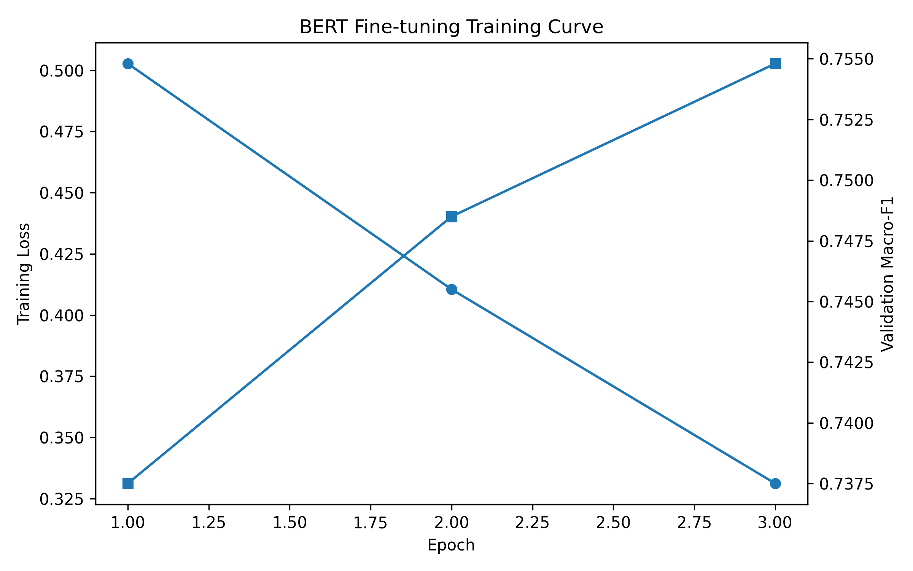
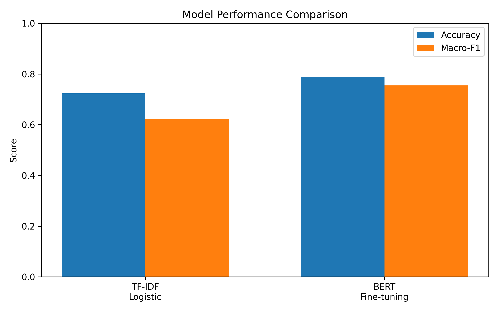
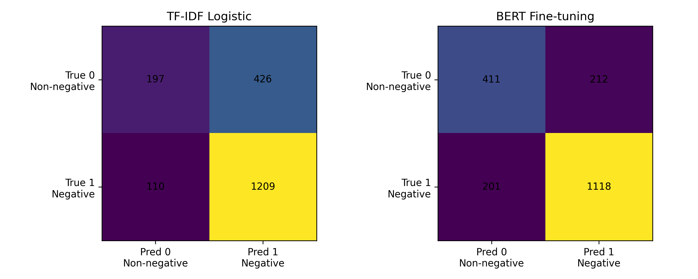
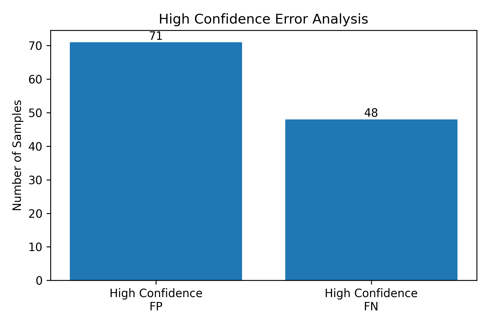

# Stage 3 — BERT Fine-tuning 与结果分析

项目：Financial Text Analysis and Inference System  
记录日期：2026 年 10 月 1 日—10 月 2 日

本阶段在已有数据划分上完成 BERT fine-tuning（微调），重点是建立正式的 validation 结果，并理解性能变化背后的得失。训练使用 17,174 条 sample，评估使用固定的 1,942 条 validation sample；本次需要回答的是：BERT 在当前输入条件下改善了哪些判断，哪些错误仍然存在，以及这些错误是否与模型实际看到的信息有关。

## 1. 长文本统计决定了这次实验的边界

训练前的长度统计显示，输入的平均长度为 1,377.16 tokens，median 为 1,223，P90 为 2,479；17,174 条训练 sample 中有 15,651 条超过 512 tokens，占 91.1%。这意味着 truncation（截断）会影响绝大多数训练输入，不能只把 `max_length` 当成一个常规配置项。这里的 91.1% 是需要截断的 sample 比例，并不是被删除的 token 比例；真正影响分类的是被删掉的部分是否包含目标公司的事件证据，而长度统计本身还不能回答这一点。

本次 `bert-base-chinese` baseline（基线）使用 `max_length=512`，输入保持为目标公司与“标题 + 正文”组成的 paired input，并采用 `truncation="only_second"`，只截断新闻部分。这个选择首先保证模型始终知道当前要判断哪家公司，再把剩余 token 预算分配给新闻；512 的总预算也包含公司名和 special tokens，并不等于可以保留 512 tokens 的正文。不过，保住目标公司字段与保住该公司的事件证据是两件事：公司名虽然仍在输入开头，正文中解释其身份、行为或关联关系的段落仍可能被截掉。因此，这一设置提供了明确的输入边界，却没有解决长文本的信息覆盖问题。

本阶段先固定这一标准配置，得到后续能够比较的结果，chunking（分块处理）等策略留待单独实验。这样做的意义是明确记录当前模型在什么信息条件下取得了什么效果，而不是认为新闻开头已经足够。后续如果调整输入范围，就可以检查新增上下文究竟纠正了哪些错误，而不只比较一个总分是否上涨。

## 2. 正式训练中，loss 与 validation 指标并不完全同步

正式训练使用 `bert-base-chinese`、batch size 16、AdamW、learning rate `2e-5`，在 RTX 3090 24GB 上训练 3 个 epochs。各轮保持相同的输入策略和 validation，因此可以比较训练推进时模型在同一批未参与参数更新的样本上的表现。

| Epoch | Training loss | Validation Accuracy | Validation Macro-F1 |
|---|---:|---:|---:|
| 1 | 0.5027 | 0.7791 | 0.7375 |
| 2 | 0.4105 | 0.7889 | 0.7485 |
| 3 | 0.3312 | 0.7873 | 0.7548 |

Training loss 持续下降，但 validation 的改善已经明显放缓。尤其从第 2 轮到第 3 轮，Accuracy 略降，Macro-F1 却继续提高，说明“预测正确的总数更多”和“两类的 F1 平均更高”并不总是对应同一轮结果。考虑到本任务中 negative 占多数，仅按 Accuracy 选择容易忽略 non-negative 的表现；按 Macro-F1 比较，第 3 轮是本次三轮中的最佳结果，下面统一报告这一轮。这个过程让我更明确地区分了训练拟合程度与评估目标：loss 下降可以说明模型继续适应训练样本，但不能据此认定所有 validation 指标都会同步变好。

## 3. BERT 的提升主要体现在哪里，又付出了什么代价

读 FP/FN 时，我需要把新闻情绪与分类评估中的类别名称分开。本项目关注的是能否检出负面事件，因此把 negative 对应的 label 1 设为 positive class（正类），把 non-negative 对应的 label 0 设为 negative class（负类）。这里的 positive 表示我们要检出的类别，不代表新闻内容是正面的；non-negative 也只表示没有被标注为负面，并不等于利好。

| 模型预测的任务类别 | 预测 label | 评估中的预测类别 | 预测错误时如何命名 |
|---|---:|---|---|
| negative（负面） | 1 | positive（预测为正类） | 真实为 0、预测为 1：False Positive（FP，误报） |
| non-negative（非负面） | 0 | negative（预测为负类） | 真实为 1、预测为 0：False Negative（FN，漏报） |

因此，不能直接把 negative 与 FP、non-negative 与 FN 画等号。Positive/negative 说明模型预测了哪一类，true/false 才说明预测是否正确：预测为 1 且真实为 1 是 TP，预测为 0 且真实为 0 是 TN；只有预测与真实标签不一致时，才分别成为 FP 或 FN。这样再看下面的错误数量，FP 就是“把目标公司误判为负面”，FN 就是“漏掉目标公司的负面事件”。

| 指标 | TF-IDF + Logistic Regression | BERT |
|---|---:|---:|
| Accuracy | 0.7240 | 0.7873 |
| Macro-F1 | 0.6211 | 0.7548 |
| Non-negative F1 | 0.4237 | 0.6656 |
| Negative F1 | 0.8186 | 0.8441 |
| False Positive（FP，误报） | 426 | 212 |
| False Negative（FN，漏报） | 110 | 201 |

BERT 的 Accuracy 提高约 6.33 个百分点，Macro-F1 提高 0.1337，但最值得关注的是错误分布发生了变化。BERT 将 FP 从 426 降到 212，减少 214 条，约下降一半；同时 FN 从 110 增加到 201，多漏掉了 91 条负面 sample。总错误由 536 条降到 413 条，改善是真实的，但它并不是在所有错误类型上同时取得进步。

Non-negative F1 从 0.4237 提升到 0.6656，是 Macro-F1 增长的主要来源，说明模型更能把非负面目标从负面预测中区分出来。Negative 的变化则解释了为什么不能只盯着单一指标：其 Recall 从 0.9166 降到 0.8476，但 Precision 从 0.7394 升到 0.8406，最终 F1 仍从 0.8186 提高到 0.8441。也就是说，当前模型预测为 negative 时更准确，却遗漏了更多实际负面样本。如果后续更重视负面事件的覆盖率，这部分代价就必须继续关注，不能只用 Macro-F1 上升概括全部结果。

这些变化与我希望通过 BERT 改善的目标一致：减少“文章里有负面线索，就连带把其中其他公司也判负”的情况。不过，汇总指标只能确认误报减少，不能直接证明模型已经学会公司与事件之间的关系。本次 TF-IDF 使用全文，BERT 使用截断输入，两者的信息范围也不同；因此可以说 BERT 在当前配置下取得了更好的 validation 表现，但还不能把全部增益严格归因于上下文建模，更不能把 FP 的净减少数当成已确认修复的实体归属错误数。

## 4. 高置信错误需要区分“没有看到证据”和“没有正确利用证据”

在预测错误且预测类别的 softmax probability 大于 0.9 的样本中，FP 有 71 条，FN 有 48 条。它们值得优先阅读，因为模型并非只在类别分数接近时出错，也会明显偏向错误答案。不过，这里的 probability 是模型输出的置信分数，并不表示该答案在现实中有超过 90% 的正确率；这些计数本身也无法告诉我们错误来自截断、实体关系还是标注口径。

FP 主要问题：

模型能够识别新闻中的负面事件，但是难以判断该事件是否真正属于当前目标公司。

例如：

目标公司： OPPO广东移动通信有限公司

标题： 投资小宇宙 \| OPPO芯片急刹车，未必只是经济性所致

模型预测 Negative probability: 0.9626

该新闻包含明显负面语义，但实际标签为
non-negative，说明商业分析中的负面描述和真正针对公司的负面事件仍有区别。

FN 主要问题：

模型可能没有正确利用公司关系、事件主体或上下文信息。

进一步分析需要区分：

1.  关键证据是否因为 512 token 限制被截断；
2.  证据已经存在，但模型没有正确理解。

对 FP，我需要核对的是负面事件是否真的属于目标公司。审计机构、投资方和关联企业可能与负面事件出现在同一篇新闻中，但共同出现并不足以确定责任或影响归属；反过来，也不能仅凭“它是审计机构”就默认它一定 non-negative。判断仍要回到原文中的具体行为和数据集标签，而不能把某种公司角色直接当作答案。本阶段的误报下降支持继续检查这种目标归属问题，但没有逐条核对前，不能把剩余 FP 全部归为同一种原因。

对 FN，首先应该把完整新闻与实际送入模型的截断文本对照：如果负面事件只出现在被删除的后文，模型没有接触到关键证据，单纯要求它“更理解金融文本”并不能补回缺失的信息；如果证据已经保留，却仍然漏报，才更有理由继续检查专业事件措辞、公司简称和关联关系是否被正确利用。输入覆盖不足与已有证据的利用不足可能同时存在，但它们需要不同的验证方式，不能仅凭一条预测错误就确定原因。

## 5. 这一阶段得到的理解

结合这次对比，我对两种模型的差异有了更具体的理解：当前 TF-IDF baseline 主要依赖字符片段的出现情况及其 TF-IDF 权重，这种权重同时考虑出现频率与片段在不同文本中的普遍程度，因此“只看关键词次数”只是一个简化理解。它缺少对目标公司与事件关系的直接建模；同一篇新闻拆成针对不同公司的多条 sample 后，共享的负面文本特征可能让这些目标一起被判为 negative，即使事件只针对其中一家公司。这里仍然是每条 sample 判断一个目标公司，问题在于换了目标以后，模型可能没有充分区分事件归属。BERT 能结合目标公司和保留下来的新闻上下文建模，本次更高的 Macro-F1 和更少的 FP 说明整体判别有所改善，但并不代表所有公司关系都已经被准确识别。

对于 BERT 的局限，我把“对部分词和文本理解不够”进一步拆成两层：一层是即使看到了相关内容，模型对某些金融事件表达、公司角色和关联关系仍可能学习得不充分；另一层是本次输入受 `max_length=512` 限制，部分判断证据可能根本没有进入模型。前者涉及如何利用已有上下文，后者涉及上下文是否完整，两者都会限制最终判断，却不能用同一种原因解释。91.1% 的训练 sample 需要截断，使信息覆盖成为本阶段必须重视的问题，但要确定某条错误是否由此造成，仍需对照原文和实际输入。后续可以在固定模型与数据划分的条件下调整上下文选取，再检查同一批 FP/FN 是否被纠正，从而把这些理解变成能够验证的结论。
