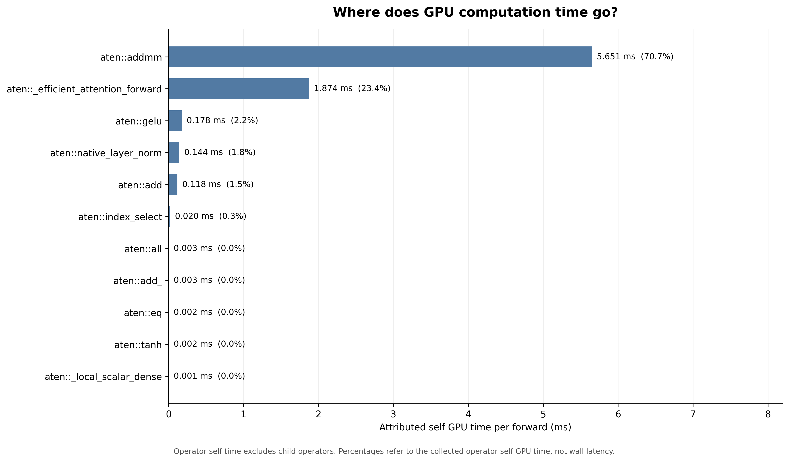
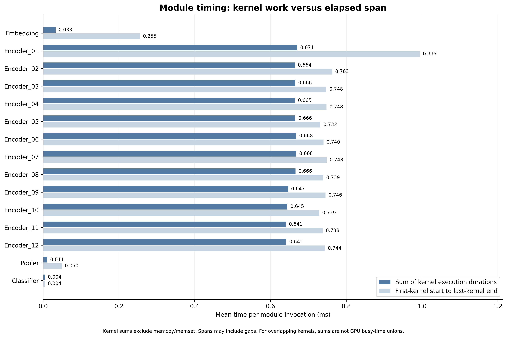
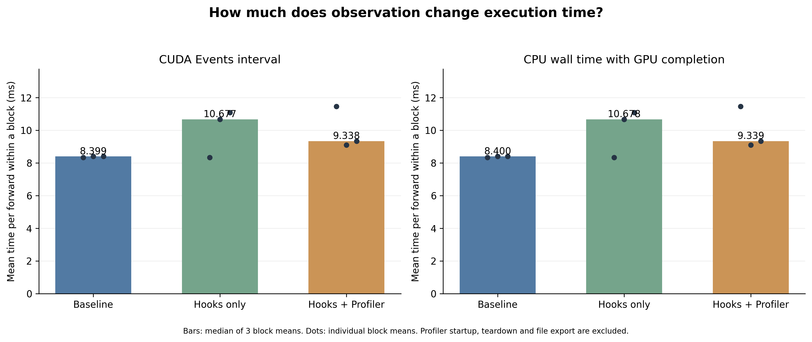

# Stage 5 — GPU Profiling 与执行开销分析

## 本阶段目标

本阶段沿用已经训练并验证计算路径的 BERT，通过 PyTorch Profiler 观察一次 forward 的实际执行过程，将模型中的 Linear、Attention、LayerNorm 和 GELU 对应到底层算子与 GPU kernels。重点是理解时间主要花在哪里、CPU 如何提交工作，以及如何正确解释不同的计时口径，为后续推理优化提供依据。

本阶段固定模型、输入和精度，不进行 batch size 或并发扫描。实验使用 RTX 3090、float32、batch size=1，输入 shape 为 `(1, 512)`，目标公司为“深圳市华彩世纪化妆品有限公司”。模型处于 eval 模式，使用 inference_mode；输入准备和 CPU 到 GPU 的传输在被观察的 forward 区间之外完成。

## 从模型模块到实际执行

Linear 是模型中多处使用的线性变换，计算形式为 `Y = XWᵀ + b`。一个 Encoder layer 包含 Q、K、V 三个投影、attention 输出投影，以及 FFN 的扩维和降维，共6个 Linear。12层合计72个，再加上 Pooler 和 Classifier，这条模型路径共包含74个 Linear 模块。

PyTorch 算子与 GPU kernel 不是相同层级的概念。算子描述程序执行的操作，例如矩阵乘法、加法或归一化；kernel 是实际在 GPU 上运行的计算程序。一个算子可能关联一个或多个 kernels，某些操作也可能使用融合实现，因此不能把模块数、算子数、kernel 数和 attention head 数混为一谈。

CPU 执行 Python 和 PyTorch 调用，通过 CUDA 接口提交 GPU 工作。CUDA 的异步执行允许 CPU 在 GPU 尚未完成当前工作时继续提交后续操作；相关计算仍需遵守依赖关系。因此，CPU 算子区间不代表 CPU 自己完成了对应的矩阵计算，也不等于 GPU 的计算耗时。

## 观察工具与实验输出

`scripts/stage5_profile_bert.py` 对相同输入进行预热，然后记录3次 forward。Profiler 收集 CPU 算子、CUDA runtime 调用和 GPU 活动，输出算子统计、模块图以及 `trace.json`。

脚本使用 forward hooks 为模型模块添加开始和结束标记。Hook 是在指定位置触发的回调函数，本次只用于给时间线标注 Embedding、Encoder layers、Pooler 和 Classifier，不修改权重、输入或输出。Hooks 负责添加名称，Profiler 负责记录执行信息，绘图脚本负责展示结果；这些观察过程本身也可能影响执行速度。

## 算子开销分布

图：每次 forward 的 GPU 算子归因 self time。百分比以图中统计的算子 self time 总和为分母，不是完整请求延迟的百分比。

| 算子 | 对应计算 | 平均时间 / forward | 占比 |
|---|---|---:|---:|
| aten::addmm | Linear 相关矩阵乘法与 bias 加法 | 5.651 ms | 70.7% |
| aten::_efficient_attention_forward | Attention 核心计算 | 1.874 ms | 23.4% |
| aten::gelu | FFN 激活函数 | 0.178 ms | 2.2% |
| aten::native_layer_norm | LayerNorm | 0.144 ms | 1.8% |
| aten::add | 包括残差等逐元素加法 | 0.118 ms | 1.5% |

当前配置下，Linear 相关计算是主要 GPU 算子时间来源。这里的 Linear 同时包含 attention 的 QKV 与输出投影，以及 FFN 等部分，不能把70.7%全部归为 FFN。图中单独列出的 attention 算子主要对应投影之后的注意力核心计算，不代表完整 attention 模块的全部开销。

根据 trace 中的输入 shape，进一步统计关联 GPU kernels，可以拆出以下 Linear 计算：

| Linear 类型 | 每次 forward 的逻辑调用次数 | GPU kernel 时间 / forward |
|---|---:|---:|
| Q、K、V 和 attention 输出投影，768 → 768 | 48 | 约2.333 ms |
| FFN 扩维，768 → 3072 | 12 | 约1.517 ms |
| FFN 降维，3072 → 768 | 12 | 约1.752 ms |

FFN 两个 Linear 的 kernel 时间合计约3.269 ms。这里采用关联 kernel 时长统计，与算子图的归因时间口径略有不同，不要求与图中的 addmm 数值完全相加吻合。较高的时间占比表明这些操作值得关注，但尚不足以判断它们受算力还是内存带宽限制。

Trace 中实际出现了 `fmha_cutlassF_f32_aligned_64x64_rf_sm80(...)` kernel，与 `aten::_efficient_attention_forward` 对应，说明此次执行已经使用 memory-efficient attention 路径。不能把手动构建完整 attention matrix 的教学实现当成原生模型的实际执行方式，也不能把“开启 SDPA”当作尚未使用的新优化。

## 模块计时口径的修正

最初模块图使用的数值与 trace 中 GPU 模块标记区间的长度一致。这类区间可能包含 kernel 之间的间隙，不能直接解释成纯 GPU 计算时间。因此，使用 `scripts/stage5_analyze_trace.py` 重新分析已有 trace，将两种指标分别展示：模块关联 kernels 的执行时间之和，以及首个 kernel 开始到最后一个 kernel 结束的时间区间。

图：深色为 kernel 执行时长之和，浅色为 kernel 首尾区间，均按模块调用取平均。Kernel 时间之和不包含 memcpy、memset；若 kernels 重叠执行，其时长之和也不等于实际 GPU 忙碌时间。

修正后，各 Encoder layer 的平均 kernel 时间大约为0.64–0.67 ms，比较接近。第一层的首尾区间较长，但 kernel 时间之和没有明显增加，因此不能据原始模块图断言第一层执行了更多计算。Embedding 的 kernel 时间约0.033 ms，而首尾区间约0.255 ms，也体现了“区间长度”与“计算时长”的区别。

## 一个 Encoder layer 的 CPU/GPU 时间线

图：第二次 forward 的第二个 Encoder layer。上方为选定 CPU 算子区间，中间为 CUDA 提交调用，下方为关联 GPU kernels 和内存操作。虚线表示 Linear CPU 调用与首个关联 GPU kernel 的对应关系，不表示同步等待时间。

| 指标 | 数值 |
|---|---:|
| CPU 模块区间 | 0.7164 ms |
| GPU kernel 执行时间之和 | 0.6886 ms |
| GPU kernel 首尾区间 | 0.7399 ms |
| 关联 kernel 数 | 12 |

图中可以按顺序识别 Q、K、V projection、attention 核心、输出投影、残差与 LayerNorm，以及 FFN 和第二次残差与 LayerNorm。本次记录的12个 kernels 是实际执行事件的数量，与12个 attention heads 没有对应关系。

| Linear | CPU 区间 | GPU kernel 时间 |
|---|---:|---:|
| Q | 0.0573 ms | 0.0532 ms |
| K | 0.0417 ms | 0.0491 ms |
| V | 0.0382 ms | 0.0492 ms |
| O | 0.0425 ms | 0.0509 ms |
| FFN-up | 0.0515 ms | 0.1314 ms |
| FFN-down | 0.0413 ms | 0.1525 ms |

以 Q projection 为例，CPU 执行 `attention.query(x)`，准备并提交计算后，可以继续处理 K 的调用，而 GPU 随后执行生成 Q 的矩阵运算。输入与权重已经位于 GPU 上，并不是每个 Linear 都重新从 CPU 传输完整输入。

FFN-up 的 CPU 区间约0.0515 ms，GPU kernel 却执行约0.1314 ms，说明 CPU 处理调用的时间与 GPU 完成计算的时间是不同指标，不能直接相加或相减来推算等待时间。六个 Linear 的 kernel 时间合计约0.4863 ms，占该层 kernel 总时间约70.6%；其中 FFN 两个 Linear 合计约0.2839 ms，占约41.2%。

该层 kernel 首尾区间与 kernel 时间之和相差约0.0513 ms。差额可能包含内存操作和间隙，不能全部称为 GPU 空闲，也不能直接归因于 CPU 瓶颈。Profiler 对执行节奏的影响同样需要考虑。

## 观测开销实验

为检查观察工具是否影响执行速度，使用 `scripts/stage5_measure_overhead.py` 比较正常运行、仅添加 hooks、以及 hooks 与 Profiler 同时启用三种方式。每个计时块重复20次 forward，共3轮，并轮换条件顺序。每种条件开始前进行预热，输入始终驻留 GPU。

CUDA Events 指标测量两个 GPU 计时标记之间的区间，可能包含工作之间的间隙，不是 kernel 时间之和。Wall 指标从 CPU 开始计时，直到提交的 GPU 工作完成后停止。两者都除以20，得到每个计时块内平均每次 forward 的耗时；这不是包含 tokenizer 和传输的完整请求延迟。Profiler 启动、退出时的处理及文件导出不计入该区间。

图：柱子为3个计时块均值的中位数，散点为每个计时块的均值，保留散点以展示波动。

| 条件 | 第1轮 CUDA interval | 第2轮 | 第3轮 | 中位数 |
|---|---:|---:|---:|---:|
| Baseline | 8.332 ms | 8.399 ms | 8.399 ms | 8.399 ms |
| Hooks only | 8.332 ms | 10.677 ms | 11.082 ms | 10.677 ms |
| Hooks + Profiler | 11.464 ms | 9.097 ms | 9.338 ms | 9.338 ms |

Baseline 较稳定，正常执行约为8.4 ms；带观察工具的两组存在明显波动。中位数相对 baseline 分别增加27.1%和11.2%，但不能将这两个百分比当成固定工具开销，也不能因为 Hooks + Profiler 的中位数低于 Hooks only，就认为 Profiler 能加速模型。三轮测量不足以确定这种排序的原因。

