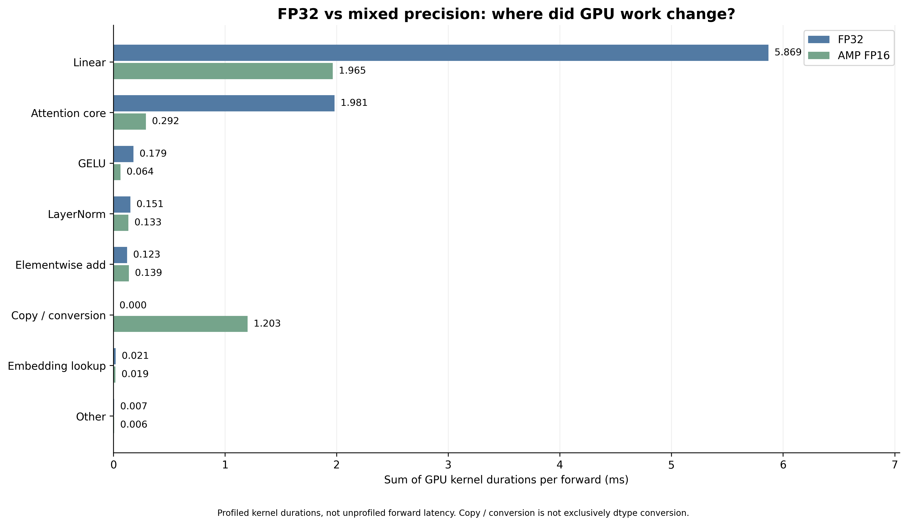

# Stage 6 — 自动混合精度推理优化

## 本阶段目标与结论

Stage 5 的 profiling 显示，在当前 FP32 配置下，Linear 相关计算占据主要 GPU 算子时间。因此，本阶段使用已经训练好的 BERT，验证 FP16 自动混合精度能否降低推理耗时，并检查数值变化是否影响分类质量。实验不重新训练模型，不改变输入处理、模型结构或分类规则。

在 RTX 3090 上，batch=1、512-token 输入的 forward 耗时由 FP32 的8.312 ms降至混合精度的6.544 ms，加速约1.270×，耗时减少21.3%。另在 batch=16 的完整1,942条验证样本上，两种模式的逐条分类预测全部一致，Accuracy 和 Macro-F1 均未变化。后续 profiling 观察到 Linear 的 kernel 时间明显缩短，attention 从 memory-efficient 实现切换到 Flash Attention 实现，同时出现额外复制／转换开销。

这些结果支持在当前任务与已验证条件下使用混合精度，但不代表所有输入和 batch size 都具有相同收益，也不意味着原模型已有的分类错误被消除。

## 实验配置与比较方式

| 配置项 | 设置 |
|---|---|
| GPU | NVIDIA GeForce RTX 3090 |
| PyTorch | 2.5.1+cu124 |
| Transformers | 4.57.1 |
| 模型目录 | `models/stage3_bert_full` |
| 验证数据 | `data/processed/validation_samples.jsonl` |
| 参数存储 dtype | 两种模式均为 float32 |
| 推理设置 | `model.eval()`、`torch.inference_mode()` |
| FP32 matmul TF32 | 关闭 |
| float32 matmul precision | highest |
| 输入格式 | 目标公司与“标题 + 换行 + 正文”配对 |
| 截断策略 | `truncation="only_second"`，最大长度512 |
| Autocast 生命周期 | 每次 forward 单独进入、退出 |

速度实验固定使用第一条验证样本，目标公司为“深圳市华彩世纪化妆品有限公司”，输入 shape 为 `(1, 512)`。质量实验使用完整验证集，batch size=16，并在同一批输入 tensors 上分别执行 FP32 与混合精度，确保两种模式使用相同的样本顺序、截断与 padding。

速度与质量实验的 batch size 不同，因此1.270×加速只对应所测 batch=1 配置，不能直接推广到 batch=16。

## AMP 的含义与精度变化

AMP 是 Automatic Mixed Precision，即自动混合精度。FP 是 Floating Point，即浮点数；FP32 和 FP16 分别使用32位和16位表示一个浮点数，这些数字不是保留的小数位数。FP16 的表示范围与精细程度不同于 FP32，因此转换与低精度计算可能引入舍入误差。

本实验通过 `torch.autocast(device_type="cuda", dtype=torch.float16)` 启用混合精度，由框架按算子规则处理精度。没有对整个模型调用 `.half()`，模型保存的参数在运行前后仍为 FP32。部分算子执行时使用低精度版本的数据，其他操作保持或使用 FP32。因此，“混合精度”不表示整个模型都变成 FP16，也不表示两种精度各占一半。

使用 hooks 观察第一层关键模块，得到以下输出 dtype：

| 模块 | FP32 baseline | AMP FP16 |
|---|---|---|
| Embedding | float32 | float32 |
| Q、K、V projection | float32 | float16 |
| Attention 输出投影 O | float32 | float16 |
| 第一次 LayerNorm | float32 | float32 |
| FFN 扩维 | float32 | float16 |
| GELU | float32 | float16 |
| FFN 降维 | float32 | float16 |
| 第二次 LayerNorm | float32 | float32 |
| Classifier | float32 | float16 |

Q projection 的模块输入和参数都显示为 FP32，但输出为 FP16，说明模块内部的算子受 autocast 规则影响。Hook 观察的是模块边界的 tensors，不是内部算子转换后的全部输入，也不能据此确定 kernel 内部每一步乘法与累加的精度。

Attention 输出投影后还有残差相加：FP32 的层输入与 FP16 的 attention 输出相加，结果提升为 FP32，再进入 LayerNorm。FFN 后的残差连接也具有类似现象，因此数据并非一旦变为 FP16，就在后续所有模块中一直保持 FP16。

## 单样本数值验证

先使用同一条样本观察混合精度的输出变化，不进行计时。两种模式的 logits 在比较前统一转为 FP32，Softmax 也统一在 FP32 中计算；这种转换不会恢复此前低精度计算中丢失的信息。

| 指标 | FP32 | AMP FP16 |
|---|---|---|
| Logits | `[-1.9187684, 2.6119728]` | `[-1.9189453, 2.6113281]` |
| p(non-negative) | 0.01065787 | 0.01066281 |
| p(negative) | 0.98934209 | 0.98933721 |
| Prediction | 1 | 1 |

最大 logits 绝对差异约为0.00064468，最大概率绝对差异约为4.93e-6。当前样本的类别分数间隔较大，这些数值变化没有改变最终预测。不过，单样本一致不能证明整个验证集上的分类质量不变，因此后续进行了完整验证集对照。

## 无 Profiler 的推理速度对照

正式测速重新加载模型，不注册观察用 hooks，也不启用 Profiler。输入提前放到 GPU，计时不包含 tokenizer 和 CPU 到 GPU 的输入传输。每种模式先预热20次，每个计时块运行50次 forward，共4轮，并轮换两种模式的执行顺序。

每次混合精度 forward 单独进入、退出 autocast，不跨多个调用保持同一个 autocast 区间。因此，测量包含这种调用方式下的上下文和转换开销，而不是只测低精度矩阵计算。

| 轮次 | FP32 CUDA interval | AMP FP16 CUDA interval |
|---|---:|---:|
| 1 | 8.263 ms | 6.539 ms |
| 2 | 8.295 ms | 6.548 ms |
| 3 | 8.391 ms | 6.538 ms |
| 4 | 8.329 ms | 6.549 ms |
| 四个计时块均值的中位数 | **8.312 ms** | **6.544 ms** |

CPU 端等待 GPU 完成后的 Wall 指标，中位数分别为8.309 ms和6.541 ms，与 CUDA Events 结果接近。两者测量边界和时钟不同，不要求数值完全一致，也不能相加。

加速比按 `FP32 耗时 / AMP 耗时` 计算，结果约为1.270×；耗时减少比例按 `1 - AMP 耗时 / FP32 耗时` 计算，结果约为21.3%。四轮中混合精度均更快，在本次重复测量中呈现稳定收益。

CUDA Events 测量的是两个 GPU 标记之间的执行区间，可能包含工作之间的间隙，不是纯 kernel 时间之和。这里的结果是重复 forward 的平均耗时，不是包含预处理、传输、服务排队等环节的完整请求延迟，也没有测量尾延迟。

## 完整验证集的分类质量检查

质量对照使用全部1,942条验证样本，batch size=16。每批只进行一次 tokenization，两种模式复用相同输入 tensors。FP32 重新计算，避免将旧预测文件可能存在的执行配置差异混入精度比较。

| 指标 | FP32 | AMP FP16 |
|---|---:|---:|
| Accuracy | 0.787333 | 0.787333 |
| Macro-F1 | 0.754840 | 0.754840 |
| TN | 411 | 411 |
| FP | 212 | 212 |
| FN | 201 | 201 |
| TP | 1118 | 1118 |

混淆矩阵的行是真实标签，列是预测标签，顺序均为 `[non-negative=0, negative=1]`。两种模式均为：

```text
[[411,  212],
 [201, 1118]]
```

| 逐样本与数值对照 | 结果 |
|---|---:|
| 预测不一致数量 | 0 / 1942 |
| 预测一致率 | 100% |
| FP32 正确 → AMP 错误 | 0 |
| FP32 错误 → AMP 正确 | 0 |
| 最大 logits 绝对差异 | 0.00425518 |
| 每条样本最大类别概率差的均值 | 0.00009527 |
| 每条样本最大类别概率差的 P95 | 0.00035928 |
| 全部样本最大概率绝对差 | 0.00180286 |
| NaN / Inf | 未出现 |

预测逐条一致，比仅观察 Accuracy 相同提供了更明确的证据：不存在部分样本变好、部分样本变差而刚好抵消的情况。原模型的212个 FP 和201个 FN 仍然存在，混合精度在本次验证中没有新增或修正这些分类错误。

“所有预测一致”不等于“所有数值完全一致”。Logits 和概率仍有变化，但没有改变当前验证样本的 argmax 结果。这一结论不能保证未来所有输入的预测都保持一致。

## Profiling：解释加速来源

速度与质量验证完成后，对 FP32 和混合精度分别进行针对性 profiling。输入固定为 `(1, 512)`，每种模式预热20次，记录5次 forward，不添加模块 hooks，保持每次 forward 独立进入 autocast 的方式。

图中直接累计 trace 内的 GPU kernel 时长，并根据关联 CPU 算子归类。两种模式均没有未能关联到 CPU 算子的 kernel。该统计不包含 CPU 开销，memcpy 和 memset 活动也不混入图中的计算类别；复制／转换类别统计的是关联到 copy 等算子的计算 kernels。



图：按计算类别汇总的 GPU kernel 时间，每次 forward 取平均。这里用于解释执行变化，不替代无 Profiler 的正式速度结果。

| 计算类别 | FP32 | AMP FP16 |
|---|---:|---:|
| Linear | 5.8693 ms | 1.9653 ms |
| Attention core | 1.9810 ms | 0.2922 ms |
| GELU | 0.1788 ms | 0.0640 ms |
| LayerNorm | 0.1512 ms | 0.1334 ms |
| Elementwise add | 0.1227 ms | 0.1395 ms |
| Copy / conversion | 0.0000 ms | 1.2029 ms |
| Embedding lookup | 0.0209 ms | 0.0189 ms |
| Other | 0.0066 ms | 0.0056 ms |

Linear 的关联 kernel 时间由5.8693 ms降至1.9653 ms，减少约66.5%，是本次 profiling 中最大的绝对时间节省来源。该结果支持 Stage 5 根据 Linear 开销选择混合精度方向的判断，但没有进一步验证每个 Linear 所使用的具体硬件指令。

Attention 不仅改变了数据精度，也改变了底层执行实现。FP32 路径记录到 `aten::_efficient_attention_forward`，对应 `fmha_cutlassF_f32_aligned_64x64_rf_sm80(...)`；混合精度路径记录到 `aten::_flash_attention_forward`，对应 `pytorch_flash::flash_fwd_kernel<...cutlass::half_t...>`。这表明框架在当前混合精度条件下选择了 Flash Attention 路径，而不是我们手动修改了 attention 算法或额外开启了一个优化开关。因此，attention 时间的下降不能全部归因于数值精度变化本身。

混合精度还出现约1.2029 ms的 `aten::copy_` 相关 kernel 时间。模型保存 FP32 参数、部分操作采用 FP16，会产生转换或复制需求，但 `copy_` 并非只用于 dtype 转换，所以不能把这一类别全部精确归为“FP32 转 FP16”。CPU 上处理 autocast 的开销也不在这张 GPU kernel 图中。

部分计算大幅变快，不意味着完整模型能获得同等倍数的加速。其他计算、复制／转换和提交间隙仍然存在，而且 Profiler 会影响执行过程。不能将此次 kernel 统计与独立 benchmark 直接相减，精确分摊整体耗时；正式速度结论仍为无 Profiler 条件下测得的1.270×。

## 脚本与结果文件

| 文件 | 用途 |
|---|---|
| `scripts/stage6_inspect_precision.py` | 观察模块边界 dtype 与单样本输出 |
| `scripts/stage6_benchmark_precision.py` | 无 hooks、无 Profiler 的速度对照 |
| `scripts/stage6_validate_precision.py` | 完整验证集质量与逐条预测对照 |
| `scripts/stage6_profile_precision.py` | Kernel 耗时与执行路径对照 |
| `results/stage6_precision/benchmark.json` | 四轮测速配置与结果 |
| `results/stage6_precision/validation_summary.json` | 分类指标与数值误差汇总 |
| `results/stage6_precision/validation_comparison.jsonl` | 逐样本预测与概率对照 |
| `results/stage6_precision/profiling/fp32_trace.json` | FP32 执行记录 |
| `results/stage6_precision/profiling/amp_fp16_trace.json` | 混合精度执行记录 |
| `results/stage6_precision/profiling/kernel_comparison.json` | Kernel 分类统计与名称 |
| `figures/stage6_precision/precision_kernel_comparison.png` | 本阶段 kernel 耗时对照图 |

上述路径均相对于项目根目录。当前脚本使用固定输出路径，再次运行会更新对应结果文件。

## 阶段总结

在 RTX 3090 上，采用 FP16 自动混合精度后，batch=1、512-token 输入的 forward 耗时由 8.312 ms 降至 6.544 ms，加速约 1.27×；另在 batch=16 的完整 1,942 条验证样本上，分类预测与 FP32 全部一致，Accuracy 和 Macro-F1 均未变化。

在当前配置下，自动混合精度缩短了 Linear 的 GPU kernel 时间，并使 attention 选择了 Flash Attention 路径，同时引入额外复制／转换开销。无 Profiler 测速显示，forward 从 8.312 ms 降至 6.544 ms，加速 1.270×；在完整 1,942 条验证样本上，分类预测与 FP32 全部一致。

